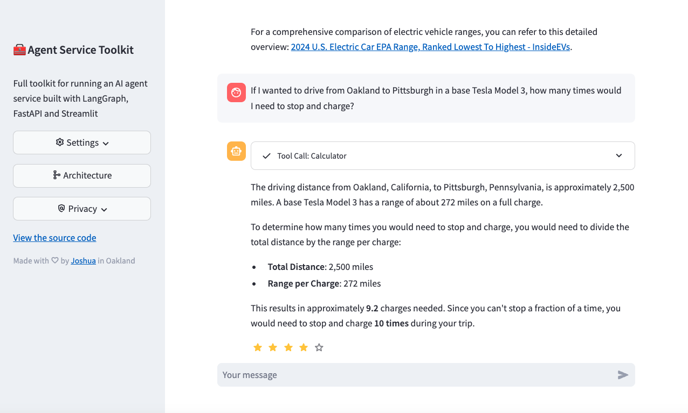

# 🧰 AI Agent 服务工具箱

这是一个用于运行基于 LangGraph、FastAPI 和 Streamlit 构建的 AI Agent 服务的完整工具箱。

它包含一个 [LangGraph](https://langchain-ai.github.io/langgraph/) 智能体、一个用于提供服务的 [FastAPI](https://fastapi.tiangolo.com/) 服务端、一个用于与服务交互的客户端，以及一个使用该客户端提供聊天界面的 [Streamlit](https://streamlit.io/) 网页应用。数据结构和设置均使用 [Pydantic](https://github.com/pydantic/pydantic) 构建。

本项目为您提供了一个模板，方便您使用 LangGraph 框架轻松构建和运行自己的智能体。它演示了从智能体定义到用户界面的完整设置，通过提供完整、健壮的工具箱，让您可以更轻松地启动基于 LangGraph 的项目。

**[🎥 观看仓库和应用的代码导读视频](https://www.youtube.com/watch?v=pdYVHw_YCNY)**

## 概览

### 运行截图



### 快速开始

直接在 Python 中运行：

```sh
# 至少需要一个大模型（LLM）的 API 密钥
echo 'OPENAI_API_KEY=your_openai_api_key' >> .env

# 推荐使用 uv 来安装依赖，但 "pip install ." 同样适用
# 有关 uv 的安装选项，请参阅：https://docs.astral.sh/uv/getting-started/installation/
curl -LsSf https://astral.sh/uv/0.7.19/install.sh | sh

# 安装依赖。"uv sync" 会自动创建 .venv
uv sync --frozen
source .venv/bin/activate
python src/run_service.py

# 在另一个终端中
source .venv/bin/activate
streamlit run src/streamlit_app.py
```

使用 Docker 运行：

```sh
echo 'OPENAI_API_KEY=your_openai_api_key' >> .env
docker compose watch
```

### 架构图


### 核心特性

1. **LangGraph 智能体及最新特性**：使用 LangGraph 框架构建的可自定义智能体。实现了最新的 LangGraph v1.0 特性，包括通过 `interrupt()` 实现的人机协同（Human-in-the-loop）、通过 `Command` 进行流程控制、使用 `Store` 实现的长期记忆，以及 `langgraph-supervisor`。
2. **FastAPI 服务**：为智能体提供流式（Streaming）和非流式（Non-streaming）接口。
3. **高级流式输出**：一种支持基于 Token 和基于 Message 的双重流式处理新方案。
4. **Streamlit 界面**：提供用户友好的聊天界面以与智能体交互，包含语音输入和输出支持。
5. **多智能体支持**：在服务中运行多个智能体，并通过 URL 路径调用。可用智能体和模型在 `/info` 中描述。
6. **异步 design**：使用 async/await 关键字，高效处理并发请求。
7. **内容审查**：集成 Safeguard 进行内容安全审查（需要 Groq API 密钥）。
8. **RAG 智能体**：基于 ChromaDB 的基础 RAG 智能体实现 - 参见[文档](docs/RAG_Assistant.md)。
9. **反馈机制**：包含与 LangSmith 集成的星级反馈系统。
10. **Docker 支持**：包含 Dockerfile 和 docker-compose 文件，方便开发和部署。
11. **测试**：包含针对整个仓库的单元测试和集成测试。

### 核心文件结构

本仓库的结构如下：

- `src/agents/`：定义了具有不同能力的多个智能体
- `src/schema/`：定义了协议数据结构和 Schema
- `src/core/`：核心模块，包含 LLM 定义 and 设置
- `src/service/service.py`：用于提供智能体服务的 FastAPI 服务
- `src/client/client.py`：与智能体服务交互的客户端
- `src/streamlit_app.py`：提供聊天界面的 Streamlit 应用
- `tests/`：单元测试和集成测试

## 安装与使用

1. 克隆本仓库：

   ```sh
   git clone <your-repository-url>
   cd agent-service-toolkit
   ```

2. 配置环境变量：
   在根目录下创建一个 `.env` 文件。至少需要提供一个大模型（LLM）的 API 密钥或配置。请参考 [`.env.example` 文件](./.env.example) 获取完整的环境变量列表，其中包含多种模型供应商的 API 密钥、基于 Header 的认证配置、LangSmith 追踪、测试和开发模式，以及 OpenWeatherMap API 密钥。

3. 您现在可以在本地运行智能体服务和 Streamlit 应用（可以通过 Docker 或直接使用 Python）。推荐使用 Docker 设置，这样能简化环境配置，并在修改代码时自动重载服务。

### 针对特定 AI 供应商的附加配置

- [配置 Ollama](docs/Ollama.md)
- [配置 VertexAI](docs/VertexAI.md)
- [使用 ChromaDB 配置 RAG](docs/RAG_Assistant.md)

### 构建与自定义您自己的智能体

要针对您自己的业务场景自定义智能体：

1. 在 `src/agents` 目录下添加您新的智能体。您可以复制 `research_assistant.py` 或 `chatbot.py` 并进行修改，以改变智能体的行为和工具。
2. 在 `src/agents/agents.py` 的 `agents` 字典中导入并添加您的新智能体。之后可以通过 `/<your_agent_name>/invoke` 或 `/<your_agent_name>/stream` 调用。
3. 在 `src/streamlit_app.py` 中调整 Streamlit 界面，使其与您的智能体能力相匹配。

### 隐私凭证文件处理

如果您的智能体或所选的 LLM 需要基于文件的凭证文件或证书，我们提供了 `privatecredentials/` 目录以方便您开发。该目录下的所有内容（`.gitkeep` 文件除外）均已被 git 和 docker 的构建过程忽略。请参阅[使用基于文件的凭证](docs/File_Based_Credentials.md)了解建议的用法。

### Docker 配置

本项目包含 Docker 配置，以便于开发和部署。`compose.yaml` 文件定义了三个服务：`postgres`、`agent_service` 和 `streamlit_app`。每个服务的 `Dockerfile` 都在其对应的目录中。

对于本地开发，我们建议使用 [docker compose watch](https://docs.docker.com/compose/file-watch/)。当检测到源代码发生变化时，它会自动更新您的容器，提供更顺畅的开发体验。

1. 确保系统上已安装 Docker 和 Docker Compose (>= [v2.23.0](https://docs.docker.com/compose/release-notes/#2230))。

2. 从 `.env.example` 复制并创建 `.env` 文件。您至少需要提供一个 LLM API 密钥（例如 `OPENAI_API_KEY`）。
   ```sh
   cp .env.example .env
   # 编辑 .env 文件并添加您的 API 密钥
   ```

3. 在 watch 模式下构建并启动服务：

   ```sh
   docker compose watch
   ```

   这会自动：
   - 启动智能体服务连接的 PostgreSQL 数据库服务
   - 使用 FastAPI 启动智能体服务
   - 启动用于用户界面的 Streamlit 应用

4. 当您修改代码时，服务会自动更新：
   - 相关 Python 文件和目录的更改将触发对应服务的更新。
   - **注意**：如果您修改了 `pyproject.toml` 或 `uv.lock` 文件，需要通过运行 `docker compose up --build` 重新构建服务。

5. 在 Web 浏览器中访问 `http://localhost:8501` 来使用 Streamlit 应用。

6. 智能体服务的 API 将在 `http://0.0.0.0:8080` 可用。您可以通过 `http://0.0.0.0:8080/redoc` 访问 OpenAPI 文档。

7. 使用 `docker compose down` 停止服务。

### 基于 AgentClient 开发其他应用

本仓库包含一个通用的 `src/client/client.AgentClient` 类，可用于与智能体服务进行交互。该客户端设计灵活，可用于在智能体服务之上构建其他应用。它支持同步和异步调用，以及流式和非流式请求。

有关如何使用 `AgentClient` 的完整示例，请参阅 `src/run_client.py` 文件。快速示例：

```python
from client import AgentClient
client = AgentClient()

response = client.invoke("给我讲个简短的笑话？")
response.pretty_print()
```

### 使用 LangGraph Studio 进行开发

该智能体支持 [LangGraph Studio](https://langchain-ai.github.io/langgraph/concepts/langgraph_studio/)（LangGraph 智能体开发集成环境）。

`langgraph-cli[inmem]` 已通过 `uv sync` 安装。您只需如上所述在根目录下添加 `.env` 文件，然后使用 `langgraph dev` 启动 LangGraph Studio。根据需要自定义 `langgraph.json`。请参阅[本地快速入门](https://langchain-ai.github.io/langgraph/cloud/how-tos/studio/quick_start/#local-development-server)了解更多信息。

### 不使用 Docker 的本地开发

您也可以仅使用 Python 虚拟环境或 Anaconda 环境，在本地运行智能体服务和 Streamlit 应用。

#### 方案 A：使用本地 Anaconda 环境（已配置的推荐环境）

本项目已记录并推荐使用如下 Python 环境：
- **Python 路径**：`D:\software\anaconda\envs\py312\python.exe`

在此环境下安装依赖：
```sh
D:\software\anaconda\envs\py312\python.exe -m pip install -e .
```

#### 方案 B：使用 uv 创建的 .venv 虚拟环境

1. 创建虚拟环境并安装依赖：

   ```sh
   uv sync --frozen
   source .venv/bin/activate
   ```

2. 运行 FastAPI 服务器：

   ```sh
   python src/run_service.py
   ```

3. 在另一个独立的终端中运行 Streamlit 应用：

   ```sh
   streamlit run src/streamlit_app.py
   ```

4. 打开浏览器并导航到 Streamlit 提供的 URL（通常为 `http://localhost:8501`）。

## 贡献

欢迎提交贡献！请随时提交 Pull Request。目前，测试需要在不使用 Docker 的本地开发环境下运行。要运行智能体服务的测试：

1. 确保您处于项目根目录下并已激活虚拟环境。
2. 安装开发依赖和 pre-commit 钩子：

   ```sh
   uv sync --frozen
   pre-commit install
   ```

3. 使用 pytest 运行测试：

   ```sh
   pytest
   ```

## 许可证

本项目基于 MIT 许可证开源 - 详情请参阅 LICENSE 文件。
